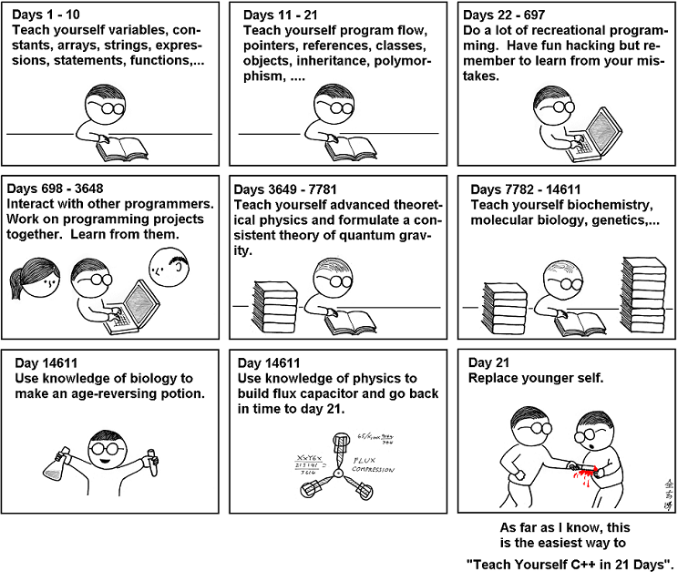

[Link](https://medium.com/free-code-camp/actionable-advice-to-start-learning-to-code-256833f16f78)

Đây là 1 bài viết của 1 anh chàng đã tự học lập trình, sau đây là những lời khuyên mà anh ta dành cho những ng muốn học hay đang bắt đầu học lập trình. Bài viết sẽ dc dịch nguyên văn để ng đọc thấy dc đúng ý mà anh ta muốn nói.

# The mindset
Khi tôi bắt đầu yêu lập trình, lời khuyên số 1 của tôi là học nó, bởi vì bạn thích nó, bạn sẽ tìm thấy những điều thú vị với nó.
Tại sao tôi lại nói như thế? Tôi là 1 big fan của tư tưởng "Làm những gì bạn bạn đam mê". Nói thế có vẻ thần thánh hóa nhưng nó luôn giúp ích cho tôi. Nếu bạn bắt đầu học lập trình thì bạn cần có động lực để thực hiện. Niềm đam mê và sự hứng thú sẽ giúp bạn kiên trì và nghiêm túc với quá trình học tập của mình.

Hãy nhớ rằng: Nó không phải là 1 sprint, nó là 1 cuộc thi marathon dài dài. Đừng hy vọng bạn học dc mọi thứ 1 cách nhanh chóng, không bao giờ điều đó có thể xảy ra

### Lời khuyên thứ 2: Kiên trì học tập

Như 1 software engineer, 1 trong những thách thức với tôi là theo dõi những gì mới mẻ xuất hiện trong giới công nghệ: thư viện mới ra mắt như ReactJS ra đời năm 2013, xu hướng web app như SPA, PWA, rồi tech trending như Machine Learning, AI, cryptocurrency và nhiều thứ khác nữa.

Tôi không nói chúng ta cần học mọi thứ và cảm thấy ngộp thở với những thứ đó. Quan điểm của tôi là những thứ mới dc tạo ra quá nhanh trong thế giới công nghệ., vì thế chúng ta cần có hướng học tập lâu dài.

### Lời khuyển thứ 3: Đừng để bản thân ngộp thở vì có quá nhiều thông tin hay muốn đốt cháy giai đoạn.

Khi mới bắt đầu, bạn không cần phải bắt đầu với những khái niệm trừu tượng, khó hiểu ngay hoặc đọc 1 cuốn thuật toán dày cộp.

Nó tương tự như thế này: Khi bạn muốn giảm cân, bạn không cần phải chạy marathon, thay vì đó bạn chạy 1 quãng ngắn hơn như 1 dặm chẳng hạn.

Học lập trình cũng thế, bạn không cần code và học mọi thứ ngay, hãy thực hiện theo 1 lịch trình.

Hãy làm để có những thay đổi nhỏ nhưng hãy làm thường xuyên. Code 1 thứ trong 1 thời điểm mà thôi.

### Lời khuyên thứ 4: Đừng so sánh mình với người khác.

Bởi vì điều đó không tốt đẹp gì, bạn mới bắt đầu thôi, hãy tập trung vào việc học của mình.

Thật dễ dàng khi bạn so sánh mình với đồng đội của mình và những [lập trình viên thiên tài](https://en.wikipedia.org/wiki/Gennady_Korotkevich) nhưng nó làm tăng sự đố kỵ, sân si bên trong con người bạn. Đừng để nó cản trở hành trình học tập của mình.

### Lời khuyên thứ 5: Thực hành chính là chìa khóa.

Thực hành giúp bạn hiểu dc những lý thuyết đã học, việc xây dựng nền tảng để có nền móng vững chắc từ những lý thuyết, khái niệm là rất quan trọng.

# Lý thuyết và khái niệm.

Nó thực sự quan trọng để hiểu các khái niệm lập trình căn bản và xây dựng nền tảng đầu tiên.
Nếu bạn còn đi học thì trường lớp là nơi tốt để giảng dạy các khái niệm và lý thuyết cơ bản. Nếu bạn đang học chuyên ngành Computer Science thì đã có những lớp Algorithms and Data Structures dành riêng cho bạn. Còn bạn không đi học thì Internet chính là nơi để giúp bạn học tập.

Khi tôi bắt đầu, tôi đã học trên [Codecademy](https://www.codecademy.com/) & [CS50 at Harvard](https://cs50.harvard.edu/)

Ở đó, tôi đã học basic về python trên Codecademy và C in CS50. Quan điểm của tôi là, khi mới bắt đầu, hãy chọn 1 ngôn ngữ lập trình và hãy hiểu những khái niệm căn bản như: variables, if-else, loops, data structures.

Có thể khi bạn chọn 1 khóa học, Giáo viên sẽ dạy bạn với 1 ngôn ngữ cụ thể nào đó, nhưng đừng lo lắng. Hãy tập trung vào những khái niệm căn bản(biết đâu bạn sẽ yêu ngôn ngữ lập trình mà bạ đang học như tôi đã từng học Python và Ruby).

### Tại sao tôi chọn những khóa học này?

Khi tôi tìm kiếm thứ gì đó để bắt đầu, tôi muốn hiểu sâu hơn về những khái niệm và cách dùng của chúng, CS50 dường như là nơi tốt để xây dựng 1 nền tảng vững chắc.

### Những nguồn tài liệu khác cũng có nội dung hay như:

* [Introduction to Computer Science](https://br.udacity.com/course/intro-to-computer-science--cs101/) trên Udacity. Nó cover khá là đầy đủ những khái niệm để bạn có thể hiểu về lập trình. Trên những khóa học của Udacity luôn có những khoảng thời gian để bạn thực hành sau khi bạn học khái niệm, lý thuyết.

* [MIT’s Introduction to Algorithms](http://courses.csail.mit.edu/6.006/fall11/notes.shtml) sẽ dạy bạn tư duy thuật toán. Việc hiểu thuật toán và cách chúng hoạt động là điều quan trọng nhất, khi bắt đầu hành trình học lập trình, bạn lên học nó đầu tiên. Có những cuốn sách hay về thuật toán như [Introduction to Algorithm](https://www.amazon.com/Introduction-Algorithms-3rd-MIT-Press/dp/0262033844) của CLRS và [Algorithms](https://www.amazon.com/Algorithms-4th-Robert-Sedgewick/dp/032157351X/ref=pd_sim_14_3?_encoding=UTF8&pd_rd_i=032157351X&pd_rd_r=Y548PDB04MJN6BH8MYFB&pd_rd_w=UgKc5&pd_rd_wg=CvgEt&psc=1&refRID=Y548PDB04MJN6BH8MYFB) của Robert Sedwick.

Rồi đến lúc, bạn cảm thấy bị ngộp thở với đống tài liệu bạn tìm được trên internet. Cố gắng đừng để nó xảy ra, hãy học từng khóa học 1 rồi thực hành thật nhiều.

# Training, Practicing, Coding, Building

### `Practice Practice Practice`

Tôi không thể nào kể hết được tầm quan trọng của việc thực hành khi bạn mới bắt đầu học code.

Thực hành không những giúp bạn trở thành 1 lập trình viên giỏi hơn mà còn giúp bạn thấy tự tin vào khả năng của mình.

Như những gì tôi nói ở phần đầu bài viết, tôi sẽ viết những lời khuyên có thể thực hiện được cho bạn, tùy vào hành trình học tập của bạn như nào để áp dụng cho thích hợp.

Như tôi đã làm, tôi bắt đầu học trên Codecademy. Ở đó có những khóa học thực sự tốt và là 1 nới trải nghiệm tuyệt vời để code những gì bạn đang học.

Một website khác khá là hay là [Hacker Rank](https://www.hackerrank.com/), 1 trang web học lập trình cho phép bạn chọn nhiều ngôn ngữ để luyện problem-solving. Một điều khác nữa là tôi thực sự có đam mê với Competitive Programming. Tôi đã luyện tập trên đó khoảng 2 năm trong trường đại học, cho những cuộc thi lập trình như [ACM ICPC](https://icpc.baylor.edu/).

Về cơ bản, bạn có 1 loạt các vấn đề, bạn cần phải implement 1 thuật toán để giải quyết từng vấn đề đó. Làm điều đó giúp tôi cảm thấy tự tin về kỹ năng lập trình của mình. Tôi cảm thấy tôi như là 1 stronger developer hơn sau khi được đào tạo bài bản và tham gia các cuộc thi lập trình([đây là repo của tôi trên github](https://github.com/LeandroTk/algorithms) - Tôi đã giải quyết được rất nhiều vấn đề).

Tôi là 1 người dùng trung thành trên Quora, 1 ngày nọ, tôi đọc được 1 câu trả lời tuyệt vời của [Veni Johanna](https://medium.com/@angelinavj) về 'Có phải cuộc thi lập trình thực sự giúp cải thiện kiến thức và kỹ năng của bạn như developer?'

Tôi sẽ viết ra 1 vài kỹ năng chúng ta có được khi học để tham gia cuộc thi lập trình:

1. Bạn phát triển kỹ năng chuyển đổi /mô hình vấn đề cụ thể thành 1 lớp trừu tượng.
2. You are used to registering patterns, and matching patterns against your pattern bank (Không biết dịch thế nào).
3. Bạn biết làm sao để tập trung và làm việc dưới áp lực.
4. 
5.
6.
7.
8.

Tôi thích những comment của cô ấy và đồng ý 100% với mỗi quan điểm cô ấy nêu ra. Bạn có thể xem nó [ở đây](https://www.quora.com/Does-competitive-programming-really-help-in-improving-your-knowledge-and-skill-set-as-a-developer-Are-there-better-things-that-would-help-one-amass-greater-knowledge-in-less-time/answer/Veni-Johanna)

Ý định của tôi là muốn đưa ra những lời khuyên khả thi cho bạn, vì thế tôi sẽ list ra vài website hay cho bạn để học và thực hành ngay từ ngày đầu tiên.

* [Codeforces](http://codeforces.com/): là 1 website hay để bạn luyện tập và học hỏi. Có hàng tá các vấn đề hay để luyện tập. Có Editorial là 1 điểm cộng cho website này( Editorial: Tác giả đưa ra vấn đề viết ra cách để bạn tiếp cận và giải quyết vấn đề - cần dùng những thuật toán hay data structure nào).

* [Topcoder](https://www.topcoder.com/): là website tương tự như Codeforces. Nó khá nổi tiếng với những [Competitive Programming Tutorials](https://www.topcoder.com/community/competitive-programming/tutorials/). Mỗi tutorial sẽ dạy bạn vài kỹ thuật, thuật toán hay data structure.

* [Hacker Rank](http://hackerrank.com/): là 1 website có nhiều lĩnh vực khác nhau  như: Algorithms, Data Structures, Mathematics, Programming Languages, etc. Nó có giao diện rất thân thiện và dễ sử dụng

* [Hacker Earth](https://www.hackerearth.com/) và [Code Chef](https://www.codechef.com/) cũng không tệ chút nào.

# Xây dựng project

Sau khi học kiến thức nền tảng, thực hành đủ nhiều, tôi cảm thấy bắt đầu stuck. Tôi bắt đầu tìm kiếm cách có thể lên level tiếp theo. Xấy dựng project là câu trả lời cho tôi. Tôi tự học những kiến thức căn bản về web như: HTML, CSS, JS và 1 web framework. Vào thời điểm đó tôi đã học Ruby on Rails (Ruby Web Framework) và Django (Python Web Framework).

Project đầu tiên của tôi chính là [website mà tôi đang sở hữu](http://leandrotk.github.io/tk/). Sau đó tôi đã xây dựng website nhà hàng cho mẹ tôi. Sau đó là 2 game: tic-tac-toe và snake. Tất  cả đều là web tĩnh.

Tôi thực sự cảm thấy mình đã sẵn sàng để phát triển đầy đủ 1 website. Vì thê, tôi đã xây dựng 1 bookstore online có trang quản trị admin riêng(admin có thể thêm, sửa, xóa sản phầm) và 1 trang cho khách hàng đăng nhập/đăng ký, tìm kiếm sách và mua sách. Tôi thấy hạnh phúc khi hoàn thành project này. Nó thực sự là 1 thách thức với tôi ở thời điểm đó và tôi đã học hỏi được rất nhiều. 

Sản phẩm thực tế đầu tiên mà tôi đã phát triển là trang web [aLavadeira](https://www.alavadeira.com/). Hiện tại tôi xây dựng website có tên là [Worldpackers](http://worldpackers.com/) và thiết kế API cho mobile app cho hơn 900K người dùng trên khắp thế giới.

Người bạn tốt của tôi là Douglas có những cấu chuyện hay về việc cách anh ấy bắt đầu code và phát triển ứng dụng. Anh ấy đã học những kiến thức căn bản ở trường đại học, cậu ấy luôn có hứng thú với việc tạo ra app mobile. Cậu ta đã cố gắng tạo ra nhiều ứng dụng nhưng rồi cũng từ bỏ sớm.

> “Tôi chỉ đơn giản là không biết bắt đầu như thế nào, bởi vì tôi có rất nhiều thứ để học và tôi đã không cảm thấy sắn sàng xây dựng 1 ứng dụng. Có quá nhiều thứ để học và nhiều cách để giải quyết 1 vấn đề, tôi bắt đầu thấy bế tắc khi cố tìm ra cách đúng nhất và tốt nhất. Có 2 điều quan trong nhất ở giai đoạn này là:
>1. Đặt mục tiêu đơn giản và cố học những điều cơ bản để đạt được điều đó. 
>2. Tránh cầu toàn.”
> — Doug

Lắng nghe câu chuyện của Doug, tất cả chúng ta trong quá trình học thì đều sẽ gặp bế tắc ở 1 vài chỗ nào đó. Và điều đó là hết sức bình thường khi mà cảm thấy bế tắc hoặc là không hiểu làm thế nào để bắt đầu.

>“Tôi đã nhận sự giúp đỡ từ 1 người bạn của tôi, người mà đã từng dựng 1 ứng dụng đơn giản trước đó. Tôi đã hỏi cậu ta liệu anh ta có biết cách tốt nhất để làm 1 điều gì đó cụ thể hay không và sự thật là: anh ta không biết nhưng tôi cảm thất an tâm hơn khi biết chúng đang xây dựng theo cũng 1 cách” — Doug

Nếu bạn có đồng nghiệp hoặc bạn bè có nhiều kinh nghiêm hơn bạn thì bạn có thể hỏi để họ giúp đỡ bạn. Thật là tuyệt vời khi có những mentor truyền cảm hứng và động viên bạn bắt đầu và cố làm lại.

Một cách học khác là mà chúng ta có thể học được từ câu chuyện của Doug: Anh ta đặt mục tiêu làm ứng dụng đơn giản cho lần đầu tiên.

> “Tôi đã xây dụng ứng dụng hoàn chỉnh đầu tiên và publish nên play store. Tôi đã học được rất nhiều kiến thức về Java/Kotlin/Android và có thẻ triển khai nhiều tính năng hơn trên ứng dụng này. Nó là 1 quá trình tốn thời gian. Tôi cần rất nhiều sự kiên trì.” — Doug

Tôi hoàn toàn đồng ý với Doug rằng: khi bạn bắt đầu học mới thứ gì đó, bạn cần có sự lỗ lực để giữ sự kiên trì trong học tập. Hiện giờ, Doug là 1 Android developer, anh ấy có 2 ứng dụng trên play store và là lead của Worldpackers Android app.

> “Tôi đã học lập trình bằng cách làm nhiều dự án website khác nhau khi còn trẻ. Cách tốt nhất để học kỹ năng mới là thực hành thật nhiều. Không quan trọng bạn tạo ra cái gì, miễn là bạn chọn lấy thứ gì đó và bắt đầu” — Feross Aboukhadijeh

[Câu trả lời của Feross](https://www.quora.com/How-did-Feross-Aboukhadijeh-learn-to-program-And-if-he-could-do-it-over-again-what-would-he-do-different-What-language-would-he-start-with/answer/Feross-Aboukhadijeh?) trên Quora. Anh ấy nói cách mà anh ta học lập trình làm thật nhiều side project. Câu truyện của anh ta rất truyền cảm hứng. Bạn để ý tạo lên sự tiến bộ của mình bằng cách làm project này đến project khác. Đây là lời khuyên của anh ta về học lập trình:
* Làm side project.
* Mua và đọc những quyển sách lập trình.
* Làm side project.
* Tham gia những lớp computer science.
* Làm side project.
* Đọc blog lập trình.
* Làm side project.

Đọc câu chuyện đầy của của anh ta [ở đây](https://www.quora.com/How-did-Feross-Aboukhadijeh-learn-to-program-And-if-he-could-do-it-over-again-what-would-he-do-different-What-language-would-he-start-with/answer/Feross-Aboukhadijeh?).

# Đây là danh sách các side project bạn có thể làm

* Nếu bạn là 1 gamer thì bạn có thể bắt đầu với Tic-Tac-Toe, Sudoku, or Flappy Bird.
* Nếu bạn yêu thích data, bạn có thể làm với web scraping hoặc làm việc với API data mảng chứng khoán để xây dựng và phân tích biểu đồ chứng khoán.
* Nếu bạn muốn hiểu rõ hơn về Front-end thì hãy xây dựng cho riêng bạn 1 website/portfolio.
* Nếu bạn muốn xây dựng 1 sản phẩm hoàn chỉnh, thử làm 1 trang bán sách online hoặc là 1 trang blog.

Đây là [danh sách khác](https://github.com/karan/Projects#networking) giúp bạn lựa chọn project để thực hành. Tôi đồng ý với Feross, không quan trọng bạn tạo ra cái gì, miễn là bạn lựa chọn cái gì đó và bắt đầu. Khi bắt đầu xây dựng, bạn sẽ có vấn đề, bạn sẽ bị stuck, nhưng bạn sẽ học được rất nhiều.

### Tôi biết điều đó khá thách thức, để bạn tiếp tục thực hiện những dự án sau này.

Để giữ ngọn lửa đam mê cho bản thân mình, tôi đã tìm ra 1 dự án thú vị mà bạn có thể làm hằng ngày. Nó có tên là [100 days of code](https://github.com/Kallaway/100-days-of-code). Nó đơn giản thôi, bạn viết nhật ký hằng ngày về tiến trình và suy nghĩ của bạn về 1 dự án bạn dang làm.

Và nó thực sự có hiệu quả, hãy giữ sự quyết liệt đó, hãy luôn tiếp tục làm dự án và luôn theo dõi tiến trình. Hãy để những dự án bạn làm trong 1 repo public trên github, để bạn có thể chia sẻ cho những ng bạn khác của mình. Tăng tính kết nối trên cộng đồng github, mang tính chất chia sẻ và truyền cảm hứng cho những người khác.

Trong lúc tìm kiếm, tôi cũng tìm ra được 1 story khác [How I Coded Everyday for 365 Days](https://hackernoon.com/how-i-coded-everyday-for-365-days-67ebb5fc7ae) của [Emily](https://medium.com/@emilyyu3). Như 1 câu chuyện truyền cảm hứng về tính kỷ luật và sự ham học hỏi lập trình.

Khá là cool khi cô ấy viết về những project đã làm và những gì đã học suốt 1 năm qua. Từ việc build IOS app sự dụng Swift cho đến web development (HTML, CSS, JS, Flask — Python web framework).

# Vài tài nguyên hữu ích cho bạn

### Websites:

* [freeCodeCamp](https://www.freecodecamp.org/) là 1 website tuyệt vời cho việc học web development và JavaScript. Nó hoàn toàn miễn phí.
* Udemy, CodeSchool,  Khan Academy.
* Đừng quên các khóa học dạng MOOC trên Udacity, Coursera, edX.

### Follow những người có tầm nhìn trên Twitter.

* Nếu bạn hứng thú Machine Learning, hãy follwow [ Andrew Ng](https://medium.com/@andrewng).
* Còn với programming thì tôi thích đọc những tweet của [DHH](https://medium.com/@dhh) (Ruby on Rails creator), [Dan Abramov](https://medium.com/@dan_abramov) (Redux Co-author), [Tracy Chou](https://medium.com/@triketora) (former Quora, Pinterest), [Quincy Larson](https://medium.com/@quincylarson) (freeCodeCamp creator), [Preethi Kasireddy](https://medium.com/@preethikasireddy) (Blockchain Engineer), [Dan Bader](https://medium.com/@dbader_org) (runs Real Python), và nhiều người khác nữa.

### Những bài viết chia sẻ hay về quá trình học lập trình trên medium.

* [How To Successfully Teach Yourself How To Code](https://medium.freecodecamp.org/successfully-teaching-yourself-how-to-code-f6aac23db44a) của [Lydia Hallie](https://medium.com/@lydiahallie).
* [How I went from fashion model to software engineer in 1 year](https://medium.freecodecamp.org/how-i-went-from-fashion-model-to-software-engineer-in-1-year-a7399a40d9e7)  của [Madison Kanna](https://medium.com/@madisonkanna).
* [BaseCS](https://medium.com/basecs) của [Vaidehi Joshi](https://medium.com/@vaidehijoshi).
* [Here’s Why Learning How To Code Is So Hard](https://medium.com/the-mission/heres-why-learning-how-to-code-is-so-hard-and-what-to-do-about-it-3d6fda152409) của [Kevin Kononenko](https://medium.com/@kevink).
* [I Want to Learn Programming but I Don’t Know where to Start] của [Robyn Silber](https://medium.com/@programm.r).

### Vlogs & YouTube channels.

* [Fun Fun Function](https://www.youtube.com/channel/UCO1cgjhGzsSYb1rsB4bFe4Q) là chanel của [ Mattias Petter Johansson](https://medium.com/@mpjme) - 1 cựu kỹ sư của Spotify. Nó bắt với javascript nhưng gần đây anh ấy nói về development nói chúng. Tôi thực sự thích cách anh ấy đưa ra ý tưởng của mình và trình vày từng chủ đề.
* [Mayuko](https://www.youtube.com/user/hellomayuko) là 1 iOS software engineer đang làm việc ở [Patreon](https://medium.com/@Patreon). Cô ấy cũng nói về kỹ thuật và lối sống nói chung.
* [CS Dojo](https://www.youtube.com/channel/UCxX9wt5FWQUAAz4UrysqK9A) thì tập trung vào việc tư vấn programming interview và data structure. Đây là chanel của [YK Sugishita](https://medium.com/@ykdojo) - 1 cựu kỹ sư google ở canada.
* [Joma Tech](https://www.youtube.com/channel/UCV0qA-eDDICsRR9rPcnG7tw) là kênh Youtube thú vị và thú vị nhất trong danh sách tôi đã kể. [Jonathan Ma](https://medium.com/@joma) là 1 data scientist ở Facebook. Anh ấy nói về cuộc sống của 1 kỹ sư như anh ấy và những lời khuyên về coding interview dựa vào kinh nghiệm thực tập tại 1 nhóm các công ty công nghệ.
